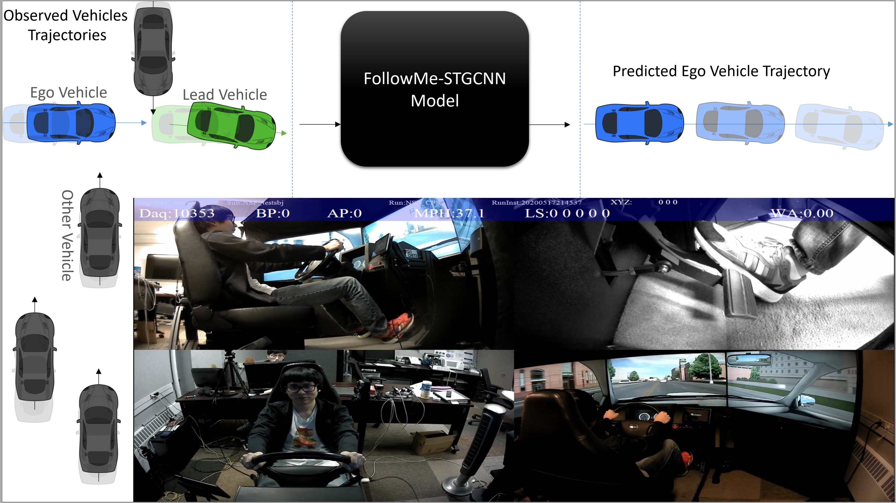
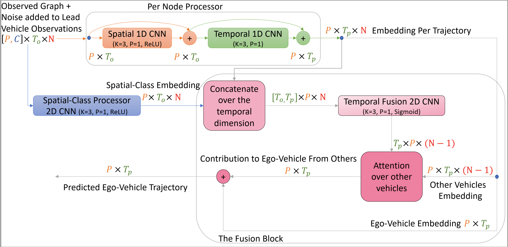

# FollowMe: Vehicle Behaviour Prediction in Autonomous Vehicle Settings

### Abduallah Mohamed*, Jundi Liu*, Linda Ng Boyle, Christian Claudel <br />
##### <sup>*</sup> Equal advising
### Read full paper <a href="https://arxiv.org/abs/2304.06121">here</a>.

### Introduction
<div align='center'>
</img>
</div>
<br />
An ego vehicle following a virtual lead vehicle planned route is an essential component when autonomous and non-autonomous vehicles interact. Yet, there is a question about the driver's ability to follow the planned lead vehicle route. Thus, predicting the trajectory of the ego vehicle route given a lead vehicle route is of interest. We introduce a new dataset, the FollowMe dataset, which offers a motion and behavior prediction problem by answering the latter question of the driver's ability to follow a lead vehicle. We also introduce a deep spatio-temporal graph model FollowMe-STGCNN as a baseline for the dataset. In our experiments and analysis, we show the design benefits of FollowMe-STGCNN in capturing the interactions that lie within the dataset. We contrast the performance of FollowMe-STGCNN with prior motion prediction models showing the need to have a different design mechanism to address the lead vehicle following settings.<br />

<br />

## FollowMe dataset
<div align='center'>
</img>
</div>
<br />
The raw files are in folder `processed`. <br />
The dataset loader is in file `dataset.py`, this folder represents the dataset in a suitable format for training and testing. 

## FollowMe-STGCNN Model: Training & Testing  
<div align='center'>
</img>
</div>
<br />

To train the model check `train.sh`.<br />
Typically you need to pass the `--pred_time`  to either 30,50,80 indicating a different prediction horizon. <br />
To test the model check `test.sh`. All it needs is to pass the folder of the checkpoint and it will produce all the metrics used in the paper ADE, FDE, AMD, AMV & KDE. <br />
The test script uses the checkpoint reported in our paper.

## Structure 
```model.py``` contains our proposed model. <br />
```train.py``` contains the training code. <br />
```test.py``` contains the testing code. <br />
```metrics.py``` contains the implementation of the code. <br />

## Remark
The code runs on python3 with the latest pytorch. 
We used pipreqs to generate the minimum needed dependencies ro tun the code. The necessary packages are in requirements.txt, you can install it by running:
```
pip3 install -r requirements.txt
```
